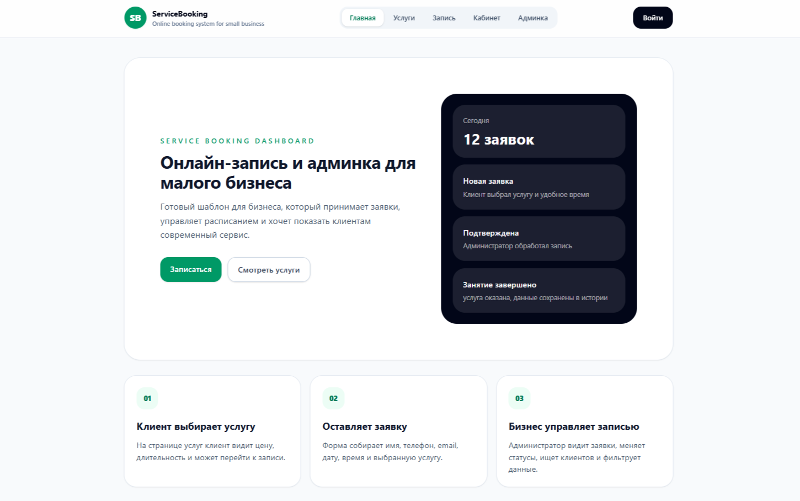
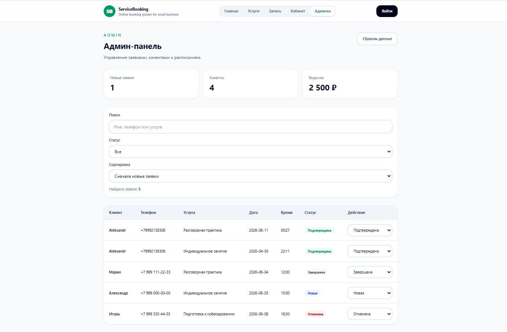
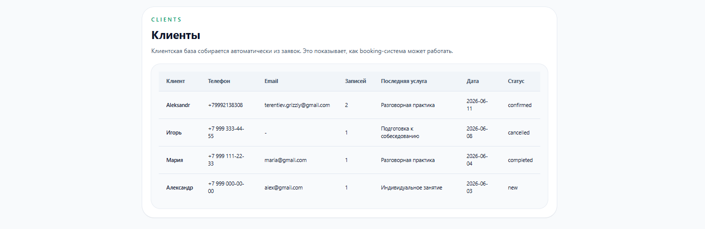
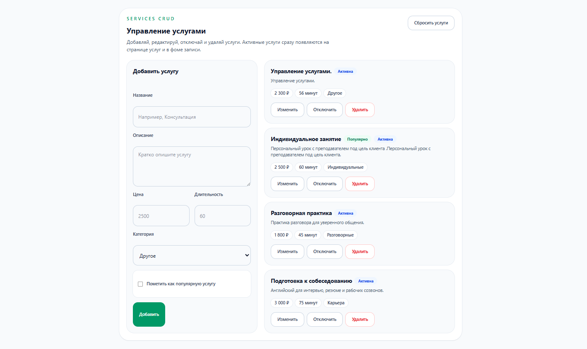
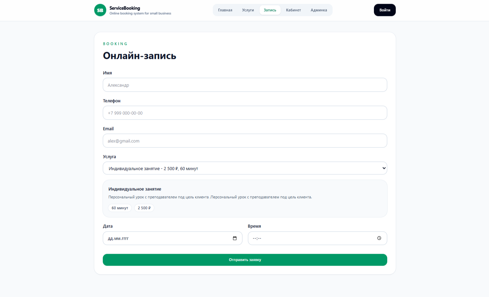
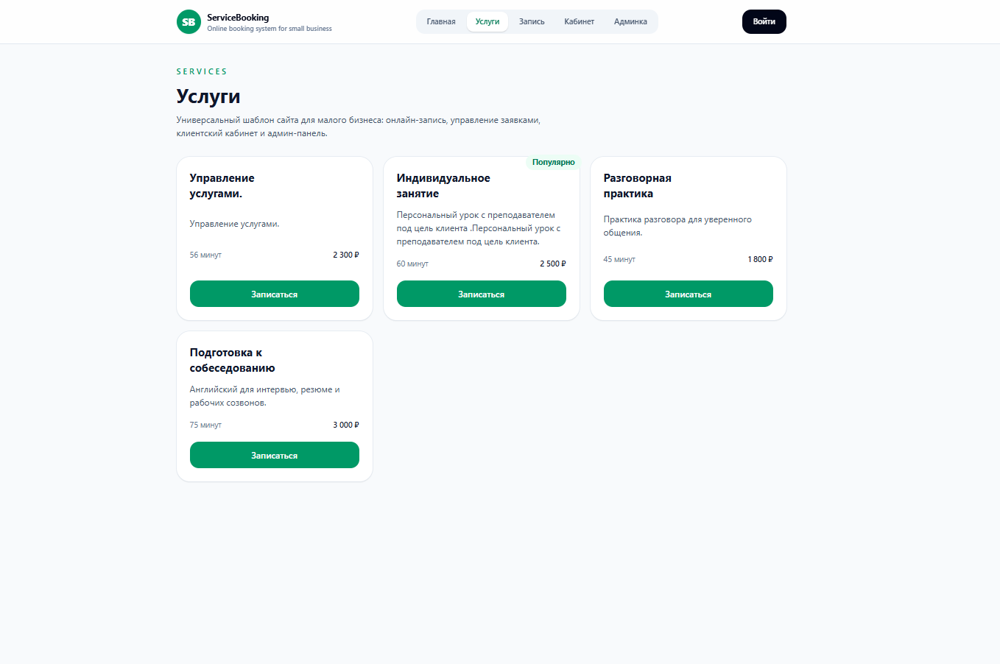

# Service Booking Dashboard

**EN:** A reusable booking dashboard template for small service business.
**RU:** Универсальный шаблон панели управления бронированием для малого бизнеса в сфере услуг.

## EN | About the Project

Service Booking Dashboard is a frontend template for service-based businesses.
The project includes a landing page, services pages, online booking form, client dashboard and admin dashboard. It demonstrates how a small business can receive booking requests, manage clients and update booking statuses.
The main idea is to create one reuseble base template that can later be adapted into several commercial projects, such as an English school, barber shop or auto service booking system.

---

## RU | О проекте

Service Booking Dashboard - это шаблон интерфейса для бизнеса, ориентированного на предоставление услуг.
Проект включает в себя целевую страницу, страницы услуг, форму онлайн-бронирования, клиентскую панель и панель администратора. Он демонстрирует, как малый бизнес может получать запросы на бронирование, управлять клиентами и обновлять статусы бронирования.
Основная идея заключается в создании одного многоразового базового шаблона, который впоследствии может быть адаптирован к нескольким коммерческим проектам, таким как школа английского языка, парикмахерская или система бронирования автосервисов.

## Demo

Live demo: [Service Booking Dashoard](https://terentakula.github.io/Service-booking-dashboard/)

## Screenshots

### Home Page

### Admin Dashboard

### Booking Form

### Services

---

## EN | Features

- Responsive landing page
- Services page
- Online booking form
- Client dashboard
- Admin dashboard
- Booking status management
- Search by client, phone or service
- Status filtering
- Booking sorting
- Local data persistence with Zustand
- Reusable UI components
- Business configuration file for template custiomization
- Mobile-friendly header
- Responsive booking form
- Mobile-friendly admin booking cards

---

## RU | О проекте

- Адаптивная главная страница
- Страница услуг
- Форма онлайн-записи
- Кабинет клиента
- Админ-панель
- Управление статусом заявок
- Поиск по клиенту, телефону или услуге
- Фильтрация по статусу
- Сортировка заявок
- Сохранение данных в localStorage через Zustand
- Повторно используемые компоненты пользовательского интерфейса
- Файл бизнес-конфигурации для настройки шаблона
- Адаптивная шапка
- Адаптивная форма записи
- Удобные для мобильных устройств карточки бронирования администратора

---

## EN | Template Use Cases

This base template can be adapted for: 

- English school booking platform
- Barber shop CRM
- Auto service booking dashboard
- Beauty studio booking system
- Private tutor booking system
- Small clinic appointment dashboard

---

## RU | Примеры использования шаблонов

Этот базовый шаблон может быть адаптирован для: 

- Сайт школы английского языка
- CRM для барбершопа
- Систему записи для автосервиса
- Сайт салона красоты
- Систему записи к репетитору
- Панели записи на прием в небольшую клинику

---

## EN | Tech Stack

- React
- TypeScript
- Vite
- Tailwind CSS
- React Router
- Zustand
- clsx
- ESLint

---

## EN | Main Functionality

### Booking Flow

Users can select a service, enter contact information, choose a date and time, and submit a booking request.
The created booking is stored in Zustand and appears immediately in the admin dashboard and client dashboard.

### Admin Dashboard 

The admin dashboard allow the business own to: 

- View all bookings
- Search bookings
- Filter bookings by status
- Sort bookings
- Update bookings status
- Reset demo data

### Client Dashboard

The Client dashboard allows users to: 

- View thier bookings
- See current bookings statuses
- Cencel bookings

---

## RU | Основной функфионал

### Онлайн-запись

Пользователь может выбрать услугу, ввести контактные данные, выбрать дату и время, отправить заявку.
Созданная заявка сохраняется в Zustand и сразу появляется в админ-панели и кабинете клиента.

### Админ-панель

Админ-панель позволяет владельцу бизнеса: 

- Смотреть все заявки
- Искать заявки
- Фильтровать заявки по статусу
- Сортировать заявки
- Менять статус заявки
- Сбрасывать данные

### Кабинет клиента

Кабинет клиента позволяет пользователю: 

- Смотреть свои записи
- Видеть текущий статус записи
- Отменять записи

---

## EN | Future Improvements

- Supabase integration
- Real authentication
- Role-based access
- Booking calendar
- Service CRUD
- Client management page
- Email or Telegram notifications
- Separate adaptations for English school, barber shop and auto service

---

## RU | Планы по улучшению

- Итеграция Supabase
- Реальная авторизация
- Доступ по ролям
- Календарь записей
- CRUD для услуг
- Страница управления клиентами
- Email или Telegram уведомления
- Отдельные адаптации под школу английского, барбершоп и автосервис

## Autor

Created by Alexander Terentiev